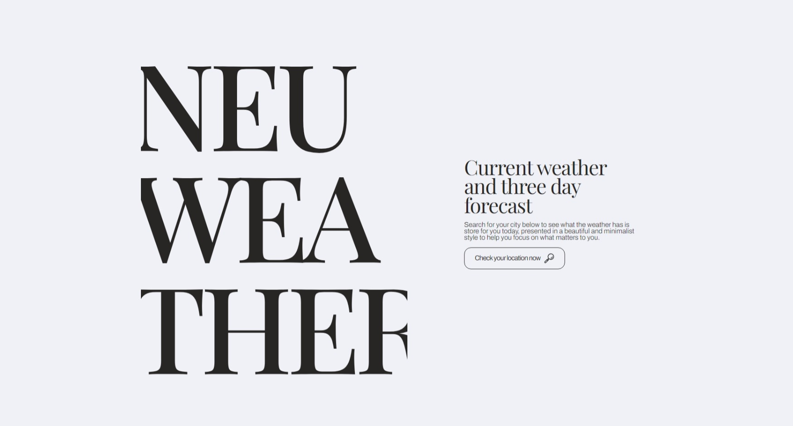

# Nueweather - A simple and minimal weather app

## Table of contents

- [Overview](#overview)
  - [The challenge](#the-challenge)
  - [Screenshot](#screenshot)
  - [Links](#links)
- [My process](#my-process)
  - [Built with](#built-with)
  - [What I learned](#what-i-learned)
  - [Continued development](#continued-development)
  - [Useful resources](#useful-resources)
- [Author](#author)

## Overview

### The challenge

Users should be able to:

- See what the current temperature and weather conditions are for their location provided by the browser. 
- See what the forecasted temperature and weather conditions for the next three days at the same hour of day as currently displayed. 
- Observe all the information in a minimal yet beautiful and responsive layout. 

### Screenshot

### Links

- Live Site URL: [Add live site URL here](https://your-live-site-url.com)

## My process

### Built with

- Semantic HTML5 markup
- CSS custom properties
- Flexbox
- Javascript 

### What I learned

Although this project was simple in nature and quick to build, there are some things that I was able to learn and utilize along the way, and chances for my skill set to grow. 

This project was the first in a queue of planned projects to build to practice both the design portion of web development, and also practice programming and different frameworks. I wanted to make this app as a single page application without using a framework like react. To implement certain actions running on the change of data loading, I was able to learn about and utilize the Mutation Observer interface that has replaced certain deprecated features of DOM events. 

I was also able to really put into practice using the developer mode in figma to rapidly get my styles written while keeping the finished product nearly identical to the mockup made in figma. 

In the design the trend that I was trying to follow was elegant and minimal. The heavy use of a serif typeface and the off-white and off-black simple color scheme really allow this design style to shine. I also experimented with masking off certain portions of oversized type to give it a modern and editorial feel. 

### Continued development

There are a few ideas that I might add at a later date, which include :
- Adding animations to the display typography on load
- Adding animations to the forecast cards
- Changing the colors or another minimal representation of weather conditions vs having a static icon 

### Useful resources

- [The Clamp Calculator ](https://royalfig.github.io/fluid-typography-calculator/#:~:text=The%20Clamp%20Calculator%20%F0%9F%A7%AE%201%20Enter%20min%20and,formula%20that%20you%20can%20copy%20into%20your%20CSS) - This calculator has been indispensable for the last several projects I have made to make styling responsive typography a breeze. It lives bookmarked and readily available in my browser. 

## Author

- Zachary Wisniewski

